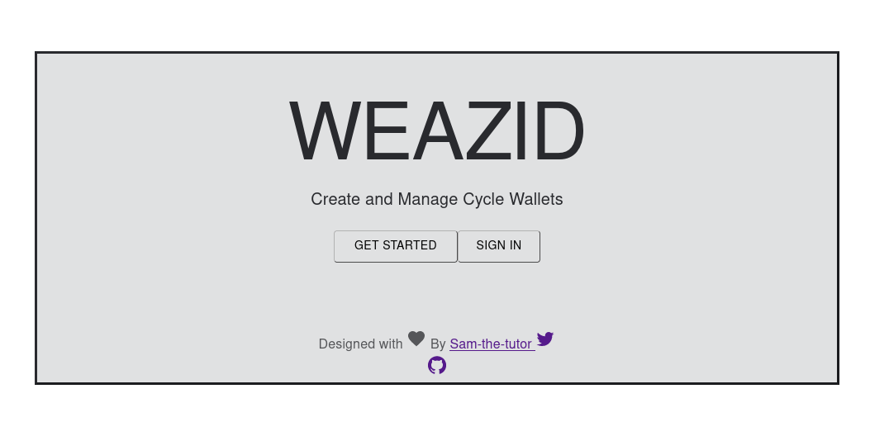
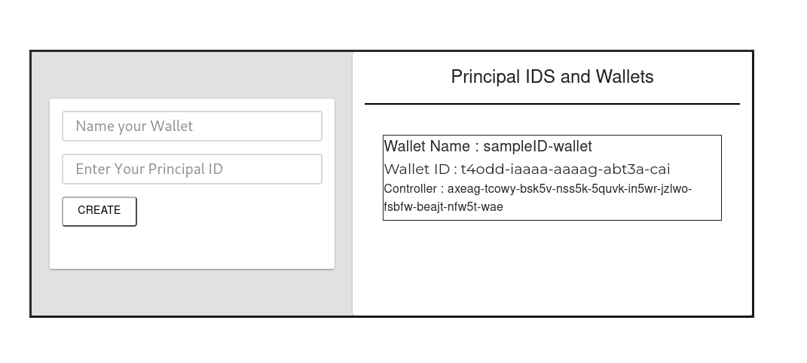

## WEAZID

[Live Link](https://ruu4g-2aaaa-aaaag-abtxa-cai.icp0.io/)

A simple Dapp built on the Internet Computer that allows you to create and manage cycle wallets efficiently.

### Background.

- Users need to create Identites in the terminal aside from the anonymous Identity that is set by default. Identities allows users to deploy canisters on the IC and also call methods on canisters already deployed on the mainnet. Newly created Identites have no wallet cycles attached to them.
- A newly created Identity can be used to do query calls but cannot be used to deploy canisters because this requires a cycles wallet to be configured with the identity that needs to deploy the canister.
- This issue has been solved temporarily through the process of requesting the cycles coupon. When a new user creates an Identity, the first thing they usualy do is to request for a ccycles coupon. The process of redeeming the cycles coupon automatically creates a wallet canister and associates with the Identity that wants to redeem the coupon thus the user does not need to worry about the whole process.
- The issue comes in when the user creates another new Identity, they can either link it with the wallet of the old Identity or request for another cycles coupon so as to link their new Identity with a new cycles wallet.

## Solution

WEAZID allows you create a new cycles wallet and link it to the newly created Identity without any hustle. If its your first Identity to be created, you dont need to go through the process of requesting for cycle coupon so as to set up your wallet. It also allows to monitor all the created wallets in one place, so you dont have to worry about forgeting their IDS.

At the moment, the wallets only come preloaded with a few cycles because they are coming from my own wallet. However I will increase that number once I get access to a bigger amount of cycles. This is to allow the wallet to come preloaded with a minimum number of cycles that allows the user to deploy one basic application on the IC.

## How to use the Dapp

As of now, you can access the dapp using the web interface.
The video tutorial can be found on the dapp home page.

## Contributions and Suggestions.

Feel free to raise a Pull Request in case you have a feature that you want to add, or you can reach me out on my socials for discussions.
Thank you
{
"WEAZID": {
"ic": "r5xx2-miaaa-aaaag-abtwq-cai"
},
"WEAZID_frontend": {
"ic": "ruu4g-2aaaa-aaaag-abtxa-cai"
}
}
